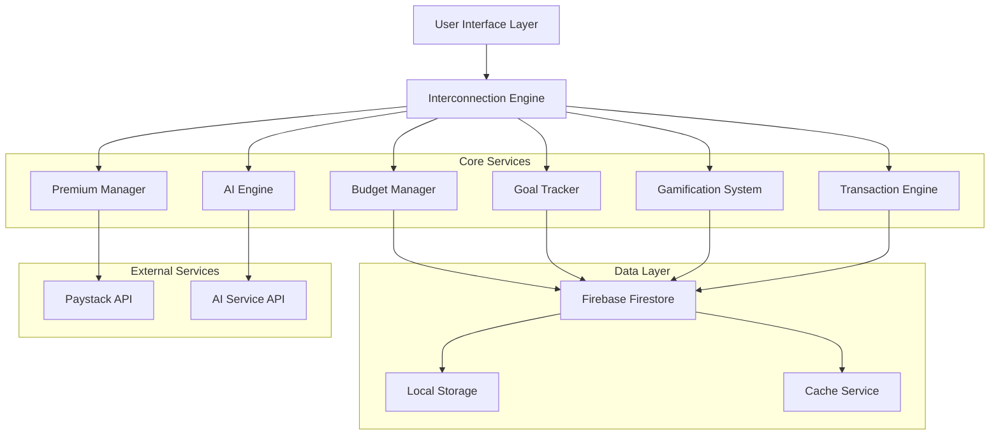
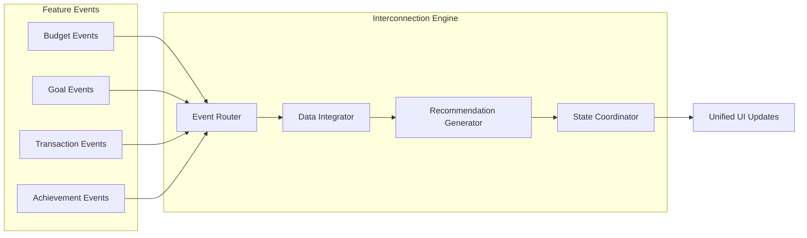

# Design Document: Interconnected Financial Experience

## Overview

This design transforms an existing Flutter expense tracking app into a cohesive, intelligent financial management ecosystem. The core innovation is the **Interconnection Engine** - a central orchestration layer that creates meaningful relationships between previously isolated features (budgets, goals, expenses, gamification, AI insights).

The system moves beyond simple feature addition to create a **unified financial intelligence platform** where each component enhances and informs the others, providing users with actionable insights and seamless workflows.

## Architecture

### High-Level Architecture



### Interconnection Engine Architecture

The Interconnection Engine serves as the central nervous system, coordinating data flow and triggering intelligent actions across all features:



## Components and Interfaces

### 1. Interconnection Engine

**Core Responsibilities:**
- Event routing and coordination between features
- Cross-feature data integration and consistency
- Intelligent recommendation generation
- State synchronization across all components

**Key Interfaces:**

```dart
abstract class InterconnectionEngine {
  // Event coordination
  Future<void> handleBudgetEvent(BudgetEvent event);
  Future<void> handleGoalEvent(GoalEvent event);
  Future<void> handleTransactionEvent(TransactionEvent event);
  
  // Cross-feature recommendations
  Future<List<Recommendation>> generateRecommendations(String userId);
  Future<SurplusAllocation> calculateOptimalSurplusAllocation(
    double surplus, List<Goal> activeGoals
  );
  
  // Data integration
  Future<FinancialSnapshot> getUnifiedFinancialView(String userId);
  Future<void> propagateDataChanges(DataChangeEvent event);
}
```

### 2. Enhanced Budget Manager

**New Capabilities:**
- Automatic surplus detection and allocation recommendations
- Integration with goal feasibility calculations
- AI-powered budget optimization suggestions

**Key Interfaces:**

```dart
abstract class BudgetManager {
  Future<BudgetSurplus> calculatePeriodSurplus(String budgetId);
  Future<List<GoalAllocation>> recommendSurplusAllocation(
    double surplus, List<Goal> goals
  );
  Future<BudgetOptimization> generateOptimizationSuggestions(
    String userId, SpendingPattern patterns
  );
}
```

### 3. Intelligent Goal Tracker

**Enhanced Features:**
- Real-time feasibility validation against actual income
- Dynamic savings target calculations
- Integration with budget surplus recommendations

**Key Interfaces:**

```dart
abstract class GoalTracker {
  Future<GoalFeasibility> validateGoalFeasibility(
    Goal goal, IncomePattern income
  );
  Future<SavingsSchedule> calculateOptimalSavingsSchedule(
    Goal goal, FinancialCapacity capacity
  );
  Future<List<GoalAdjustment>> suggestGoalAdjustments(
    String userId, FinancialSnapshot snapshot
  );
}
```

### 4. Advanced AI Engine

**Intelligence Capabilities:**
- Cross-feature pattern analysis
- Contextual spending insights
- Predictive financial recommendations
- Anomaly detection with actionable suggestions

**Key Interfaces:**

```dart
abstract class AIEngine {
  Future<List<Insight>> analyzeSpendingPatterns(
    String userId, Duration period
  );
  Future<List<Recommendation>> generateContextualRecommendations(
    FinancialSnapshot snapshot
  );
  Future<AnomalyAlert> detectSpendingAnomalies(
    List<Transaction> transactions
  );
  Future<FinancialForecast> generateFinancialForecast(
    String userId, Duration horizon
  );
}
```

### 5. Functional Gamification System

**Fixed and Enhanced Features:**
- Working XP calculation and tracking
- Visible achievement system
- Meaningful rewards (premium access, discounts)
- Progress visualization

**Key Interfaces:**

```dart
abstract class GamificationSystem {
  Future<XPReward> calculateXPReward(FinancialAction action);
  Future<List<Achievement>> checkAchievementProgress(String userId);
  Future<Reward> processAchievementReward(Achievement achievement);
  Future<GamificationStatus> getUserGamificationStatus(String userId);
}
```

### 6. Premium Manager with Free Trial

**Trial System Features:**
- Configurable trial periods
- Feature access management
- Seamless upgrade flows
- Trial status tracking

**Key Interfaces:**

```dart
abstract class PremiumManager {
  Future<TrialStatus> startFreeTrial(String userId);
  Future<bool> hasFeatureAccess(String userId, PremiumFeature feature);
  Future<void> handleTrialExpiration(String userId);
  Future<SubscriptionStatus> upgradeToPremium(String userId);
}
```

## Data Models

### Core Financial Models

```dart
class FinancialSnapshot {
  final String userId;
  final double totalIncome;
  final double totalExpenses;
  final double availableForGoals;
  final List<BudgetStatus> budgetStatuses;
  final List<GoalProgress> goalProgresses;
  final GamificationStatus gamificationStatus;
  final DateTime timestamp;
}

class BudgetSurplus {
  final String budgetId;
  final double surplusAmount;
  final DateTime periodEnd;
  final List<GoalAllocation> recommendedAllocations;
}

class GoalFeasibility {
  final String goalId;
  final bool isFeasible;
  final double requiredDailySavings;
  final double requiredWeeklySavings;
  final List<String> feasibilityFactors;
  final List<GoalAdjustment> suggestions;
}

class Recommendation {
  final String id;
  final RecommendationType type;
  final String title;
  final String description;
  final List<ActionStep> actionSteps;
  final double potentialImpact;
  final Priority priority;
}
```

### Interconnection Models

```dart
class DataChangeEvent {
  final String sourceFeature;
  final String eventType;
  final Map<String, dynamic> data;
  final List<String> affectedFeatures;
  final DateTime timestamp;
}

class CrossFeatureInsight {
  final String insightId;
  final List<String> involvedFeatures;
  final String insight;
  final List<Recommendation> recommendations;
  final double confidenceScore;
}
```

### Enhanced User Models

```dart
class UserProfile {
  final String userId;
  final IncomePattern incomePattern;
  final SpendingBehavior spendingBehavior;
  final List<FinancialGoal> goals;
  final GamificationProfile gamificationProfile;
  final PremiumStatus premiumStatus;
  final OnboardingStatus onboardingStatus;
}

class IncomePattern {
  final double weeklyIncome;
  final double monthlyIncome;
  final IncomeStability stability;
  final List<IncomeSource> sources;
  final DateTime lastUpdated;
}
```

## Correctness Properties

*A property is a characteristic or behavior that should hold true across all valid executions of a system—essentially, a formal statement about what the system should do. Properties serve as the bridge between human-readable specifications and machine-verifiable correctness guarantees.*

Before defining the correctness properties, let me analyze the acceptance criteria to determine which ones are testable as properties.

### Property 1: Budget Surplus Allocation Consistency
**Validates: Requirements 1.1**

For any budget that ends with a surplus, the system must generate allocation recommendations that:
- Sum to exactly the surplus amount
- Only recommend allocation to active, unfunded goals
- Prioritize goals by urgency and user preferences
- Maintain mathematical consistency in all calculations

```dart
property('Budget surplus allocation is mathematically consistent', () {
  forAll(budgetSurplus, activeGoals, (surplus, goals) {
    final allocations = budgetManager.recommendSurplusAllocation(surplus.amount, goals);
    
    // Total allocations must equal surplus
    expect(allocations.map((a) => a.amount).sum, equals(surplus.amount));
    
    // All recommended goals must be active and unfunded
    expect(allocations.every((a) => goals.contains(a.goal) && !a.goal.isFullyFunded), isTrue);
    
    // No negative allocations
    expect(allocations.every((a) => a.amount >= 0), isTrue);
  });
});
```

### Property 2: Goal Feasibility Mathematical Accuracy
**Validates: Requirements 1.2**

Goal feasibility calculations must be mathematically accurate and consistent with user's actual financial capacity.

```dart
property('Goal feasibility calculations are mathematically accurate', () {
  forAll(goal, incomePattern, expenses, (goal, income, expenses) {
    final feasibility = goalTracker.validateGoalFeasibility(goal, income);
    final availableWeekly = income.weeklyIncome - expenses.weeklyAverage;
    final requiredWeekly = goal.remainingAmount / goal.weeksRemaining;
    
    // Feasibility should match mathematical reality
    expect(feasibility.isFeasible, equals(requiredWeekly <= availableWeekly));
    
    // Required savings calculations should be accurate
    expect(feasibility.requiredWeeklySavings, closeTo(requiredWeekly, 0.01));
    expect(feasibility.requiredDailySavings, closeTo(requiredWeekly / 7, 0.01));
  });
});
```

### Property 3: AI Insights Data-Driven Generation
**Validates: Requirements 1.3**

AI insights must be generated based on actual user data and patterns, not generic responses.

```dart
property('AI insights are generated from actual user data', () {
  forAll(userTransactions, (transactions) {
    final insights = aiEngine.analyzeSpendingPatterns(userId, transactions);
    
    // Insights must reference actual transaction data
    expect(insights.every((insight) => 
      insight.referencesActualData(transactions)), isTrue);
    
    // Insights must be specific to user's patterns
    expect(insights.every((insight) => 
      insight.isSpecificToUser(transactions)), isTrue);
    
    // No generic/template responses
    expect(insights.any((insight) => insight.isGeneric), isFalse);
  });
});
```

### Property 4: Free Trial Access Control
**Validates: Requirements 1.4**

Free trial system must correctly manage feature access and trial periods.

```dart
property('Free trial access control is enforced correctly', () {
  forAll(user, premiumFeature, (user, feature) {
    final hasAccess = premiumManager.hasFeatureAccess(user.id, feature);
    final trialStatus = premiumManager.getTrialStatus(user.id);
    
    // Access rules must be consistent
    if (user.isPremium) {
      expect(hasAccess, isTrue);
    } else if (trialStatus.isActive && feature.availableInTrial) {
      expect(hasAccess, isTrue);
    } else if (feature.isFree) {
      expect(hasAccess, isTrue);
    } else {
      expect(hasAccess, isFalse);
    }
  });
});
```

### Property 5: XP Calculation Consistency
**Validates: Requirements 1.5**

XP calculations must be consistent and achievements must unlock properly.

```dart
property('XP calculations are consistent and achievements unlock properly', () {
  forAll(financialAction, user, (action, user) {
    final initialXP = user.gamificationProfile.totalXP;
    final xpReward = gamificationSystem.calculateXPReward(action);
    
    // XP rewards must be positive for valid actions
    expect(xpReward.amount, greaterThan(0));
    
    // XP must accumulate correctly
    final newXP = initialXP + xpReward.amount;
    expect(user.gamificationProfile.totalXP, equals(newXP));
    
    // Achievements must unlock at correct thresholds
    final achievements = gamificationSystem.checkAchievementProgress(user.id);
    achievements.where((a) => a.isUnlocked).forEach((achievement) {
      expect(newXP, greaterThanOrEqualTo(achievement.requiredXP));
    });
  });
});
```

### Property 6: Onboarding Data Integrity
**Validates: Requirements 1.6**

Onboarding data must be captured and stored correctly for use in financial calculations.

```dart
property('Onboarding data is captured and used correctly', () {
  forAll(onboardingData, (data) {
    final user = userRepository.createUserWithOnboarding(data);
    
    // Income data must be stored correctly
    expect(user.incomePattern.weeklyIncome, equals(data.weeklyIncome));
    expect(user.incomePattern.monthlyIncome, equals(data.weeklyIncome * 4.33));
    
    // Onboarding completion must be tracked
    expect(user.onboardingStatus.isComplete, isTrue);
    
    // Data must be available for calculations
    final feasibility = goalTracker.validateGoalFeasibility(
      data.initialGoal, user.incomePattern
    );
    expect(feasibility, isNotNull);
  });
});
```

### Property 7: Cross-Feature Data Consistency
**Validates: Requirements 1.7**

When data changes in one feature, all related features must maintain consistency.

```dart
property('Cross-feature data consistency is maintained', () {
  forAll(dataChangeEvent, (event) {
    final initialState = interconnectionEngine.getSystemState();
    interconnectionEngine.propagateDataChanges(event);
    final finalState = interconnectionEngine.getSystemState();
    
    // Related features must be updated
    event.affectedFeatures.forEach((feature) {
      expect(finalState.getFeatureState(feature), 
        isNot(equals(initialState.getFeatureState(feature))));
    });
    
    // Data consistency must be maintained
    expect(finalState.isConsistent(), isTrue);
    
    // No orphaned references
    expect(finalState.hasOrphanedReferences(), isFalse);
  });
});
```

### Property 8: Recommendation Relevance and Actionability
**Validates: Requirements 1.8**

Recommendations must be relevant to user's current financial state and actionable.

```dart
property('Recommendations are relevant and actionable', () {
  forAll(financialSnapshot, (snapshot) {
    final recommendations = interconnectionEngine.generateRecommendations(snapshot.userId);
    
    // Recommendations must be based on actual user data
    recommendations.forEach((rec) {
      expect(rec.isBasedOnUserData(snapshot), isTrue);
      expect(rec.actionSteps.isNotEmpty, isTrue);
      expect(rec.potentialImpact, greaterThan(0));
    });
    
    // High-priority recommendations must address urgent issues
    final highPriority = recommendations.where((r) => r.priority == Priority.high);
    highPriority.forEach((rec) {
      expect(rec.addressesUrgentIssue(snapshot), isTrue);
    });
  });
});
```

## User Experience Design

### 1. Unified Dashboard

The dashboard serves as the central hub where all interconnected features converge:

**Key Elements:**
- **Financial Health Score**: Real-time calculation based on budget adherence, goal progress, and spending patterns
- **Smart Recommendations Panel**: AI-driven suggestions that span multiple features
- **Quick Actions**: Context-aware shortcuts (e.g., "Allocate Budget Surplus to Emergency Fund")
- **Progress Visualization**: Unified view of budgets, goals, and achievements

**Interconnection Examples:**
- Budget surplus notification with one-tap goal allocation
- Goal progress updates that factor in recent budget performance
- Achievement unlocks that celebrate cross-feature milestones

### 2. Onboarding Flow

**Step 1: Welcome & Purpose**
- Explain the interconnected approach
- Set expectations for intelligent recommendations

**Step 2: Financial Profile Setup**
- Weekly/monthly income capture
- Primary financial goals identification
- Spending category preferences

**Step 3: Initial Budget & Goal Creation**
- Guided budget setup with goal integration
- Feasibility validation in real-time
- Smart defaults based on income data

**Step 4: Gamification Opt-in**
- Explain XP system and rewards
- Achievement preview
- Customization preferences

### 3. Cross-Feature Workflows

**Budget Completion → Goal Allocation:**
1. System detects budget period end with surplus
2. Analyzes active goals and priorities
3. Presents allocation recommendations with impact preview
4. One-tap allocation with XP reward
5. Updates goal progress and dashboard

**Goal Creation → Feasibility Check:**
1. User inputs goal details
2. System validates against income pattern
3. Suggests realistic timeline adjustments
4. Recommends budget category optimizations
5. Creates integrated tracking plan

**Achievement Unlock → Premium Rewards:**
1. XP threshold reached triggers achievement
2. Reward calculation (premium days, discounts)
3. Celebration animation with reward details
4. Automatic premium feature unlock or discount application

## Technical Implementation

### 1. Interconnection Engine Implementation

```dart
class InterconnectionEngineImpl implements InterconnectionEngine {
  final EventBus _eventBus;
  final DataIntegrator _dataIntegrator;
  final RecommendationGenerator _recommendationGenerator;
  
  @override
  Future<void> handleBudgetEvent(BudgetEvent event) async {
    // Process budget event
    await _dataIntegrator.updateBudgetData(event);
    
    // Check for cross-feature impacts
    if (event.type == BudgetEventType.periodEnd && event.hasSurplus) {
      final goals = await _goalRepository.getActiveGoals(event.userId);
      final recommendations = await _recommendationGenerator
          .generateSurplusAllocation(event.surplus, goals);
      
      _eventBus.fire(RecommendationEvent(
        userId: event.userId,
        recommendations: recommendations,
        trigger: 'budget_surplus'
      ));
    }
    
    // Update gamification
    if (event.type == BudgetEventType.goalMet) {
      await _gamificationSystem.awardXP(
        event.userId, 
        XPAction.budgetGoalMet
      );
    }
  }
  
  @override
  Future<List<Recommendation>> generateRecommendations(String userId) async {
    final snapshot = await getUnifiedFinancialView(userId);
    return await _recommendationGenerator.generate(snapshot);
  }
}
```

### 2. Enhanced AI Service

```dart
class EnhancedAIService implements AIEngine {
  final OpenAIClient _openAI;
  final UserRepository _userRepository;
  final TransactionRepository _transactionRepository;
  
  @override
  Future<List<Insight>> analyzeSpendingPatterns(
    String userId, 
    Duration period
  ) async {
    // Get actual user data
    final transactions = await _transactionRepository
        .getTransactionsForPeriod(userId, period);
    final user = await _userRepository.getUser(userId);
    
    // Generate context-aware prompt
    final prompt = _buildAnalysisPrompt(transactions, user);
    
    // Get AI analysis
    final response = await _openAI.complete(prompt);
    
    // Parse and validate insights
    final insights = _parseInsights(response);
    
    // Ensure insights reference actual data
    return insights.where((insight) => 
      _validateInsightReferencesData(insight, transactions)
    ).toList();
  }
  
  String _buildAnalysisPrompt(List<Transaction> transactions, User user) {
    return '''
    Analyze spending patterns for user with weekly income: ${user.incomePattern.weeklyIncome}
    
    Recent transactions:
    ${transactions.map((t) => '${t.category}: ${t.amount} on ${t.date}').join('\n')}
    
    Active goals:
    ${user.goals.map((g) => '${g.name}: ${g.targetAmount - g.currentAmount} remaining').join('\n')}
    
    Provide specific, actionable insights based on this actual data.
    Reference specific transactions and amounts in your analysis.
    ''';
  }
}
```

### 3. Gamification System Implementation

```dart
class GamificationSystemImpl implements GamificationSystem {
  final UserRepository _userRepository;
  final AchievementRepository _achievementRepository;
  final PremiumManager _premiumManager;
  
  @override
  Future<XPReward> calculateXPReward(FinancialAction action) async {
    final baseXP = _getBaseXP(action.type);
    final multiplier = _calculateMultiplier(action);
    final totalXP = (baseXP * multiplier).round();
    
    return XPReward(
      amount: totalXP,
      action: action,
      breakdown: XPBreakdown(
        base: baseXP,
        multiplier: multiplier,
        bonuses: _calculateBonuses(action)
      )
    );
  }
  
  @override
  Future<List<Achievement>> checkAchievementProgress(String userId) async {
    final user = await _userRepository.getUser(userId);
    final achievements = await _achievementRepository.getAllAchievements();
    
    final updatedAchievements = <Achievement>[];
    
    for (final achievement in achievements) {
      final progress = await _calculateAchievementProgress(user, achievement);
      
      if (progress.isUnlocked && !achievement.isUnlocked) {
        // Achievement just unlocked
        final reward = await _processAchievementReward(achievement);
        achievement.unlock(reward);
        
        // Award premium time or discount
        if (reward.type == RewardType.premiumDays) {
          await _premiumManager.addFreePremiumDays(userId, reward.value);
        }
      }
      
      achievement.updateProgress(progress);
      updatedAchievements.add(achievement);
    }
    
    return updatedAchievements;
  }
}
```

### 4. Free Trial Implementation

```dart
class PremiumManagerImpl implements PremiumManager {
  final UserRepository _userRepository;
  final SubscriptionRepository _subscriptionRepository;
  
  @override
  Future<TrialStatus> startFreeTrial(String userId) async {
    final user = await _userRepository.getUser(userId);
    
    if (user.hasUsedFreeTrial) {
      throw TrialAlreadyUsedException();
    }
    
    final trialEnd = DateTime.now().add(Duration(days: 14));
    final trialStatus = TrialStatus(
      isActive: true,
      startDate: DateTime.now(),
      endDate: trialEnd,
      remainingDays: 14
    );
    
    await _userRepository.updateTrialStatus(userId, trialStatus);
    
    // Schedule trial expiration notification
    await _scheduleTrialExpirationReminder(userId, trialEnd);
    
    return trialStatus;
  }
  
  @override
  Future<bool> hasFeatureAccess(String userId, PremiumFeature feature) async {
    final user = await _userRepository.getUser(userId);
    
    // Premium subscribers have access to everything
    if (user.subscription?.isActive == true) {
      return true;
    }
    
    // Free features are always accessible
    if (feature.tier == FeatureTier.free) {
      return true;
    }
    
    // Trial users have access to trial-enabled features
    if (user.trialStatus?.isActive == true && feature.availableInTrial) {
      return true;
    }
    
    // Gamification rewards can grant temporary access
    if (user.gamificationProfile.hasTemporaryAccess(feature)) {
      return true;
    }
    
    return false;
  }
}
```

## Testing Strategy

### 1. Property-Based Testing Setup

```dart
// test/property_tests/interconnection_properties_test.dart
import 'package:test/test.dart';
import 'package:fast_check/fast_check.dart';

void main() {
  group('Interconnection Engine Properties', () {
    testProperty('Budget surplus allocation consistency', () {
      fc.property(
        fc.record({
          'surplus': fc.double(min: 1.0, max: 10000.0),
          'goals': fc.list(goalArbitrary, minLength: 1, maxLength: 5)
        }),
        (data) async {
          final allocations = await budgetManager.recommendSurplusAllocation(
            data['surplus'], 
            data['goals']
          );
          
          // Property assertions
          expect(allocations.map((a) => a.amount).sum, 
            closeTo(data['surplus'], 0.01));
          expect(allocations.every((a) => a.amount >= 0), isTrue);
        }
      );
    });
  });
}
```

### 2. Integration Testing

```dart
// test/integration/interconnection_flow_test.dart
void main() {
  group('Cross-Feature Integration', () {
    testWidgets('Budget surplus to goal allocation flow', (tester) async {
      // Setup user with budget and goals
      final user = await createTestUser();
      final budget = await createBudgetWithSurplus(user.id);
      final goals = await createActiveGoals(user.id);
      
      // Trigger budget completion
      await budgetManager.completeBudgetPeriod(budget.id);
      
      // Verify recommendations generated
      final recommendations = await interconnectionEngine
          .generateRecommendations(user.id);
      
      expect(recommendations.any((r) => 
        r.type == RecommendationType.surplusAllocation), isTrue);
      
      // Test UI flow
      await tester.pumpWidget(createApp(user));
      await tester.tap(find.text('Allocate Surplus'));
      await tester.pumpAndSettle();
      
      // Verify goal updates
      final updatedGoals = await goalRepository.getGoals(user.id);
      expect(updatedGoals.any((g) => g.currentAmount > goals.first.currentAmount), 
        isTrue);
    });
  });
}
```

## Deployment and Rollout

### Phase 1: Core Infrastructure (Week 1-2)
- Implement Interconnection Engine
- Set up event routing system
- Create unified data models
- Basic property-based tests

### Phase 2: Feature Integration (Week 3-4)
- Enhanced Budget Manager with surplus detection
- Intelligent Goal Tracker with feasibility validation
- Cross-feature recommendation system
- Integration testing

### Phase 3: AI and Gamification (Week 5-6)
- Enhanced AI service with contextual insights
- Fixed XP system and achievement tracking
- Premium reward integration
- Free trial system implementation

### Phase 4: User Experience (Week 7-8)
- Unified dashboard implementation
- Onboarding flow with income capture
- Cross-feature workflow optimization
- User acceptance testing

### Phase 5: Polish and Launch (Week 9-10)
- Performance optimization
- Error handling and edge cases
- Documentation and user guides
- Production deployment

## Success Metrics

### Technical Metrics
- **Cross-feature consistency**: 99.9% data consistency across features
- **Recommendation relevance**: >80% user acceptance rate for recommendations
- **XP system accuracy**: 100% correct XP calculations and achievement unlocks
- **Trial conversion**: >25% trial-to-premium conversion rate

### User Experience Metrics
- **Feature interconnection usage**: >60% of users use cross-feature workflows
- **Goal achievement rate**: 40% improvement with feasibility validation
- **User engagement**: 50% increase in daily active usage
- **User satisfaction**: >4.5/5 rating for interconnected experience

### Business Metrics
- **Premium conversion**: 30% increase in premium subscriptions
- **User retention**: 25% improvement in 30-day retention
- **Feature adoption**: >70% adoption rate for new interconnected features
- **Revenue impact**: 40% increase in monthly recurring revenue

This design creates a truly interconnected financial experience where every feature enhances and informs the others, providing users with intelligent, actionable insights and seamless workflows that make financial management both effective and engaging.